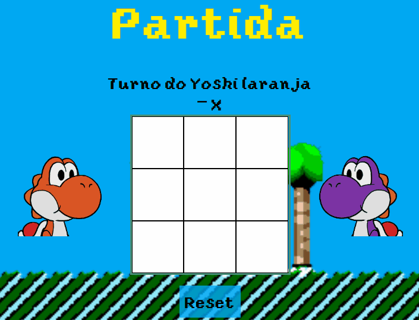
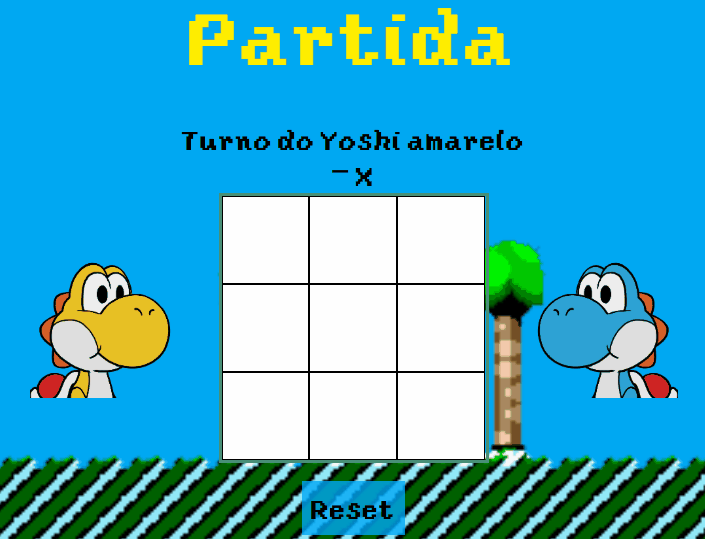
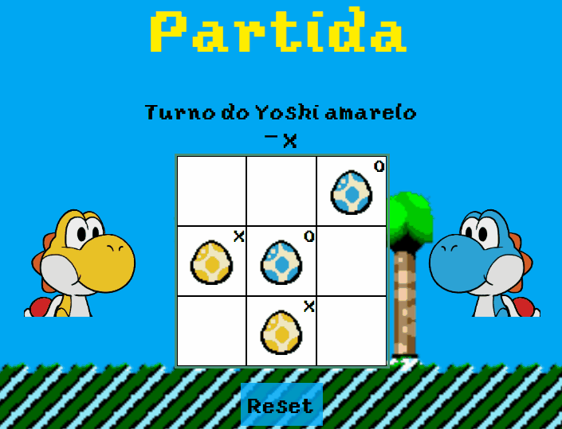

# Tic-Tac-Yoshi
## Languages
This first section is in English. 

[Versão em português logo abaixo.](#portuguese)

## Context
This game is a personal project in which I wanted to create a version of tic-tac-toe using Yoshi characters of various colors as "players".

To do this, I got the sprites of the colored Yoshis from https://www.spriters-resource.com/ and edited them using https://www.aseprite.org/. With the edited sprites, I was able to place them as possible players (and opponents) in the game, in addition to the scenery sprites as well. The fonts used in the game were taken from https://www.dafont.com/smw2-yoshis-island.font.

My goal was to have for either one or two players, with an intelligence that would play against player 1 when there was only one player, which is already possible in the latest version that I uploaded here.

## Game options
In this game, from the initial menu, you can choose the one or two player option.

<p align="center">
  
</p>

### Single Player
When selecting one player, the gameplay path is as follows:

1. Select which color Yoshi you will be (your opponent's Yoshi color will be chosen randomly);

<p align="center">
  
</p>

2. Match against an opponent who makes random moves on the still available squares (you will always be X);

<p align="center">
  
</p>

3. The game ending possibilities are "win", "draw" or "lose", according to the rules of tic-tac-toe, and the Yoshis will react according to win/draw/lose;

<p align="center">
  
</p>

### Two players (vs)
When selecting two players (versus), the game path is as follows:

1. Select which color Yoshi the first player (X) will be and which the second player (O) will be;

<p align="center">
  
</p>

2. Match between players, one against the other;

<p align="center">
  
</p>

3. The same rules as with single player, the possibilities of game ending are "win", "draw" or "lose", according to the rules of tic-tac-toe, and the Yoshis will react according to win/draw/lose;

<p align="center">
  
</p>

## How to play this game
To access this game, access its web version at https://xuaun.github.io/Tic-Tac-Yoshi/.

## Technologies used
In this project, ```HTML```, ```CSS```, ```JavaScript``` were used.

____
<br>

# <p id="portuguese">Jogo Yoshi-da-velha</p>
## Contexto
Este jogo é um projeto pessoal em que tinha como objetivo criar uma versão de jogo da velha usando os personagens Yoshis de várias cores como "players".

Para isso, peguei as sprites dos Yoshis coloridos em https://www.spriters-resource.com/ e editei usando https://www.aseprite.org/. Com as sprites editadas, pude colocá-las como opções de jogadores (e oponentes) dentro do jogo, além das sprites de cenário também. As fontes utilizadas no jogo foram retiradas de https://www.dafont.com/smw2-yoshis-island.font.

Meu objetivo era possibilitar tanto um ou dois jogadores, tendo uma inteligência que jogasse contra do player 1 quando fosse somente um jogador, isso já é possível na última versão que subi aqui.

## Opções de jogo
Neste jogo é possível, a partir do menu inicial, escolher a opção de um ou dois jogadores.

<p align="center">
  
</p>

### Um jogador
Ao selecionar um jogador, o caminho de jogo é o seguinte:

1. Selecionar qual cor de Yoshi você será (a cor de Yoshi do seu oponente será escolhido aleatoriamente);

<p align="center">
  
</p>

2. Partida contra um oponente que faz jogadas aleatórias nas casas ainda disponíveis (você sempre será X);

<p align="center">
  
</p>

3. As possibilidades de fim de jogo são "vitória", "empate" ou "derrota", segundo as regras do jogo da velha, e os Yoshis irão reagir conforme vencer/empatar/perder;

<p align="center">
  
</p>

### Dois jogadores
Ao selecionar dois jogadores (versus), o caminho de jogo é o seguinte:

1. Selecionar qual cor de Yoshi o primeiro jogador (X) será e qual o segundo jogador (O) será;

<p align="center">
  
</p>

2. Partida entre os jogadores, um contra o outro;

<p align="center">
  
</p>

3. As mesmas regras que com um jogador, as possibilidades de fim de jogo são "vitória", "empate" ou "derrota", segundo as regras do jogo da velha, e os Yoshis irão reagir conforme vencer/empatar/perder;

<p align="center">
  
</p>

## Instruções de como jogar
Para acessar este jogo, acesse sua versão web em https://xuaun.github.io/Tic-Tac-Yoshi/.

## Tecnologias utilizadas
Neste projeto, foi utilizado ```HTML```, ```CSS```, ```JavaScript``` .
